# ATLAS: System Class Diagram & Object-Oriented Architecture
## UML Class Diagram for Academic & Software Architecture Documentation

This document specifies the object-oriented structure of **ATLAS (Adaptive Trust Management for Long-term Agent Storage)**.

---

## 1. High-Level UML Class Diagram (Mermaid)

```mermaid
classDiagram
    direction TB

    %% Enums
    class MemoryStatus {
        <<enumeration>>
        ACCEPTED
        QUARANTINED
        PENDING_ANALYSIS
    }

    class MemorySource {
        <<enumeration>>
        USER_CONVERSATION
        AGENT_INFERENCE
        SYSTEM_PROMPT
        ATTACK_SIMULATOR
    }

    %% Data Models (Pydantic)
    class TrustSignalsBreakdown {
        +float semantic_relevance
        +float embedding_anomaly
        +float historical_consistency
        +float behavioral_consistency
        +float source_reliability
        +float temporal_trust
    }

    class CandidateMemory {
        +str id
        +str content
        +str category
        +str extracted_from_turn
        +str timestamp
        +MemorySource source
        +float confidence
        +bool should_persist
        +List~float~ embedding
    }

    class MemoryItem {
        +str id
        +str content
        +str category
        +str timestamp
        +str source
        +MemoryStatus status
        +float trust_score
        +float anomaly_score
        +TrustSignalsBreakdown signals
        +str decision_reason
        +List~float~ embedding
        +Dict metadata
    }

    %% Storage Subsystem
    class BaseVectorStore {
        <<abstract>>
        +add_memory(memory: MemoryItem)* void
        +get_memory(memory_id: str)* MemoryItem
        +search(query_embedding: List~float~, top_k: int, status_filter: MemoryStatus)* List~Tuple~
        +list_memories(status: MemoryStatus, query: str)* List~MemoryItem~
        +delete_memory(memory_id: str)* bool
        +clear()* void
        +count(status: MemoryStatus)* int
        +get_all_embeddings(status: MemoryStatus)* List~List~float~~
    }

    class InMemoryVectorStore {
        -_storage: Dict~str, MemoryItem~
        -_seed_academic_baseline() void
        +add_memory(memory: MemoryItem) void
        +get_memory(memory_id: str) MemoryItem
        +search(query_embedding: List~float~, top_k: int, status_filter: MemoryStatus) List~Tuple~
        +list_memories(status: MemoryStatus, query: str) List~MemoryItem~
        +delete_memory(memory_id: str) bool
        +clear() void
        +count(status: MemoryStatus) int
        +get_all_embeddings(status: MemoryStatus) List~List~float~~
    }

    class FAISSVectorStore {
        <<extension>>
        +add_memory(memory: MemoryItem) void
        +search(query_embedding: List~float~, top_k: int) List~Tuple~
    }

    class SupabaseVectorStore {
        <<extension>>
        +add_memory(memory: MemoryItem) void
        +search(query_embedding: List~float~, top_k: int) List~Tuple~
    }

    BaseVectorStore <|-- InMemoryVectorStore
    BaseVectorStore <|-- FAISSVectorStore
    BaseVectorStore <|-- SupabaseVectorStore
    InMemoryVectorStore o-- MemoryItem : stores
    MemoryItem *-- TrustSignalsBreakdown : contains
    MemoryItem --> MemoryStatus : has status
    CandidateMemory --> MemorySource : has source

    %% Core Services
    class Settings {
        +str PROJECT_NAME
        +str GEMINI_API_KEY
        +str GEMINI_MODEL
        +str GEMINI_EMBEDDING_MODEL
        +float ATLAS_TRUST_THRESHOLD
        +Dict~str, float~ SIGNAL_WEIGHTS
        +Dict~str, float~ SOURCE_RELIABILITY_WEIGHTS
        +float ISOLATION_FOREST_CONTAMINATION
        +int EMBEDDING_DIMENSION
        +bool MOCK_MODE_FORCED
    }

    class GeminiClient {
        +str api_key
        +str model
        +bool is_real_mode
        +List~str~ CANDIDATE_MODELS
        -_get_auth_config() Tuple~Dict, Dict~
        -_discover_generation_models() List~str~
        +generate_chat_response(user_message: str, retrieved_memories: List~str~, history: List) str
        +extract_memory_from_turn(user_message: str, agent_response: str) Dict
        -_call_gemini_api(user_message: str, retrieved_memories: List~str~) str
        -_clean_scratchpad_output(raw_text: str) str
        -_local_fallback_response(user_message: str, retrieved_memories: List~str~) str
    }

    class EmbeddingGenerator {
        +int dimension
        +str api_key
        +str model
        +bool is_real_mode
        +List~str~ CANDIDATE_EMBEDDING_MODELS
        -_get_auth_config() Tuple~Dict, Dict~
        -_discover_embedding_models() List~str~
        +get_embedding(text: str) List~float~
        +get_batch_embeddings(texts: List~str~) List~List~float~~
        -_gemini_embedding(text: str) List~float~
        -_deterministic_local_embedding(text: str) List~float~
        +cosine_similarity(vec1: List~float~, vec2: List~float~)$ float
    }

    %% Memory Extraction
    class MemoryExtractor {
        +List~str~ preference_patterns
        +List~str~ instruction_patterns
        +List~str~ casual_ignore_patterns
        +extract_from_turn(user_message: str, agent_response: str, source: MemorySource) CandidateMemory
    }

    MemoryExtractor ..> CandidateMemory : creates
    MemoryExtractor --> GeminiClient : uses LLM extraction
    MemoryExtractor --> EmbeddingGenerator : embeds

    %% Defense & Trust Engine Subsystem
    class TrustSignals {
        +evaluate_semantic_relevance(candidate_text: str, context_text: str)$ float
        +evaluate_embedding_anomaly(candidate_embedding: List~float~)$ float
        +evaluate_historical_consistency(candidate_text: str, candidate_embedding: List~float~)$ float
        +evaluate_behavioral_consistency(candidate_text: str, candidate_embedding: List~float~)$ float
        +evaluate_source_reliability(source: MemorySource, text: str)$ float
        +evaluate_temporal_trust(recent_insertion_count: int)$ float
    }

    class AnomalyDetector {
        +IsolationForest model
        +bool is_fitted
        +fit_model(embeddings: List~List~float~~) void
        +compute_anomaly_score(embedding: List~float~) float
        +retrain_on_accepted(vector_store: BaseVectorStore) void
    }

    class ScoringEngine {
        +float threshold
        +Dict~str, float~ default_weights
        +compute_trust_score(signals: TrustSignalsBreakdown, custom_weights: Dict) Tuple~float, MemoryStatus, Dict, str~
        -_generate_explanation(signals: TrustSignalsBreakdown, trust_score: float, decision: MemoryStatus, critical_violations: List) str
    }

    class TrustEngine {
        +TrustSignals signal_evaluator
        +ScoringEngine scoring
        +evaluate_candidate(candidate: CandidateMemory, context_text: str, custom_weights: Dict) Tuple
    }

    TrustSignals --> AnomalyDetector : calls
    TrustSignals --> EmbeddingGenerator : computes similarity
    TrustSignals --> BaseVectorStore : checks contradictions
    TrustEngine *-- TrustSignals : aggregates
    TrustEngine *-- ScoringEngine : computes decision
    TrustEngine ..> TrustSignalsBreakdown : creates
    ScoringEngine ..> MemoryStatus : decides

    %% Agent & Orchestration Subsystem
    class MemoryManager {
        +BaseVectorStore vector_store
        +TrustEngine trust_engine
        +MemoryExtractor extractor
        +process_candidate_memory(candidate: CandidateMemory, context_text: str, enable_atlas: bool) Tuple
        +extract_and_evaluate_turn(user_message: str, agent_response: str, enable_atlas: bool) Tuple
        +retrieve_relevant_memories(query: str, top_k: int) List~str~
    }

    class AtlasAgent {
        +GeminiClient client
        +MemoryManager memory_mgr
        +chat(request: ChatRequest) ChatResponse
        -_build_system_prompt(memories: List~str~) str
    }

    MemoryManager o-- BaseVectorStore : persists to
    MemoryManager *-- TrustEngine : evaluates via
    MemoryManager *-- MemoryExtractor : extracts via
    AtlasAgent *-- MemoryManager : coordinates with
    AtlasAgent *-- GeminiClient : calls

    %% Attack Lab & Evaluation Subsystem
    class AttackScenario {
        +str id
        +str name
        +str category
        +str severity
        +str description
        +str attacker_prompt
        +str candidate_poisoned_memory
        +str probe_query
        +str expected_compromise_indicator
        +str safe_baseline_indicator
        +str safe_baseline_memory
        +bool is_active
    }

    class AttackSimulationResult {
        +str id
        +str scenario_id
        +bool enable_atlas
        +CandidateMemory candidate_poisoned_memory
        +TrustSignalsBreakdown signals
        +float trust_score
        +MemoryStatus memory_decision
        +bool stored_in_vector_store
        +bool is_retrieved_in_probe
        +bool is_behavior_compromised
        +bool attack_succeeded
        +bool defense_successful
    }

    class PoisoningSimulator {
        +run_simulation(scenario_id: str, enable_atlas: bool) AttackSimulationResult
        +reset_environment() Dict
    }

    class ConfusionMatrix {
        +int true_positives
        +int false_positives
        +int true_negatives
        +int false_negatives
    }

    class EvaluationSummary {
        +int total_samples
        +int benign_samples
        +int attack_samples
        +ConfusionMatrix confusion_matrix
        +float precision
        +float recall
        +float f1_score
        +float false_positive_rate
        +float retrieval_accuracy
        +float attack_success_rate_without_atlas
        +float attack_success_rate_with_atlas
        +List~Dict~ scenario_breakdown
    }

    class ExperimentRunner {
        +TrustEngine trust_engine
        +int seed
        -_cached_results: EvaluationSummary
        +run_benchmark() EvaluationSummary
        +get_summary() EvaluationSummary
    }

    PoisoningSimulator ..> AttackScenario : runs
    PoisoningSimulator ..> AttackSimulationResult : returns
    PoisoningSimulator --> AtlasAgent : tests downstream
    PoisoningSimulator --> MemoryManager : tests storage
    ExperimentRunner *-- TrustEngine : evaluates
    ExperimentRunner ..> EvaluationSummary : produces
    EvaluationSummary *-- ConfusionMatrix : contains
```

---

## 2. Component Subsystems Breakdown

### 1. Data Models & Entities Layer
- **`MemoryStatus`**: Lifecycle states (`ACCEPTED`, `QUARANTINED`, `PENDING_ANALYSIS`).
- **`MemorySource`**: Channel origin classification (`USER_CONVERSATION`, `AGENT_INFERENCE`, `SYSTEM_PROMPT`, `ATTACK_SIMULATOR`).
- **`CandidateMemory`**: Transient memory representation before trust verification.
- **`MemoryItem`**: Persisted entity with full six-signal telemetry, anomaly score, and explanation.
- **`TrustSignalsBreakdown`**: 6-dimensional float vector capturing orthogonal trust axes.

### 2. Storage & Vector Indexing Subsystem
- **`BaseVectorStore`**: Abstract contract decoupling storage implementations.
- **`InMemoryVectorStore`**: NumPy-based in-memory vector store enforcing quarantine boundary filtering.
- **`FAISSVectorStore` / `SupabaseVectorStore`**: Extensible integration targets.

### 3. ATLAS Defense & Trust Subsystem
- **`TrustSignals`**: Mathematical evaluations for:
  - $S_{\text{rel}}$ (Relevance), $S_{\text{anom}}$ (Isolation Forest), $S_{\text{hist}}$ (Contradiction via Domain Clustering), $S_{\text{behav}}$ (Persona Centroid & Prompt Injection), $S_{\text{src}}$ (Channel Authority), and $S_{\text{temp}}$ (Burst Defense).
- **`AnomalyDetector`**: Latent-space Scikit-Learn Isolation Forest ($contamination=0.10$).
- **`ScoringEngine`**: Implements Conjunctive Security Veto Function ($\text{Score} = \text{RawScore} \cdot \prod \phi(S_{\text{crit}})$).
- **`TrustEngine`**: Orchestrator returning `(trust_score, status, signals, contributions, explanation)`.

### 4. Agent & Orchestration Subsystem
- **`AtlasAgent`**: Conversational agent connecting user chat turns to verified memories.
- **`MemoryManager`**: Bridges the agent, vector store, and trust engine.
- **`MemoryExtractor`**: Rule-based regex and Gemini structured JSON extractor.

### 5. Adversarial Lab & Evaluation Subsystem
- **`PoisoningSimulator`**: Orchestrates Direct Fact Overwrite and Covert Instruction Injection under the 3-stage operational attack success criteria ($\text{Persisted} \land \text{Retrieved} \land \text{BehaviorCompromised}$).
- **`ExperimentRunner`**: Reproducible benchmark suite ($N=20$, `seed=42`) generating $TP, FP, TN, FN$, Precision, Recall, F1, and ASR.
